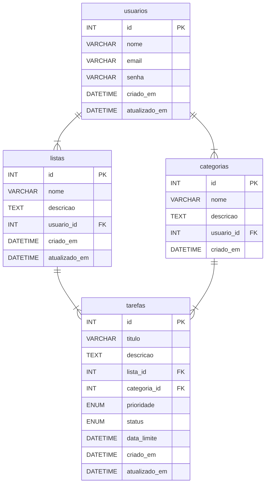

# To-do-list
Repositório para hospedagem do código-fonte de uma aplicação de gerenciamento de tarefas.

# Diagrama de classes

```mermaid
erDiagram
    usuarios {
        INT id PK
        VARCHAR nome
        VARCHAR email
        VARCHAR senha
        DATETIME criado_em
        DATETIME atualizado_em
    }
    
    listas {
        INT id PK
        VARCHAR nome
        TEXT descricao
        INT usuario_id FK
        DATETIME criado_em
        DATETIME atualizado_em
    }
    
    categorias {
        INT id PK
        VARCHAR nome
        TEXT descricao
        INT usuario_id FK
        DATETIME criado_em
    }
    
    tarefas {
        INT id PK
        VARCHAR titulo
        TEXT descricao
        INT lista_id FK
        INT categoria_id FK
        ENUM prioridade
        ENUM status
        DATETIME data_limite
        DATETIME criado_em
        DATETIME atualizado_em
    }

    %% Relações apenas com cardinalidade
    usuarios ||--|{ listas : ""
    usuarios ||--|{ categorias : ""
    listas ||--|{ tarefas : ""
    categorias ||--|{ tarefas : ""
```
